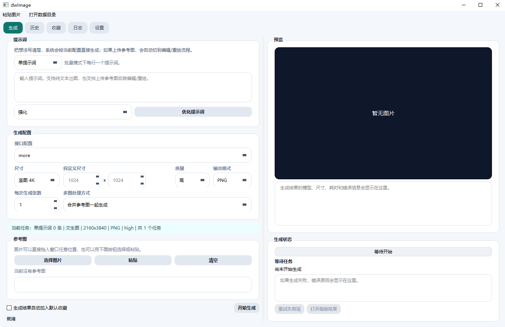
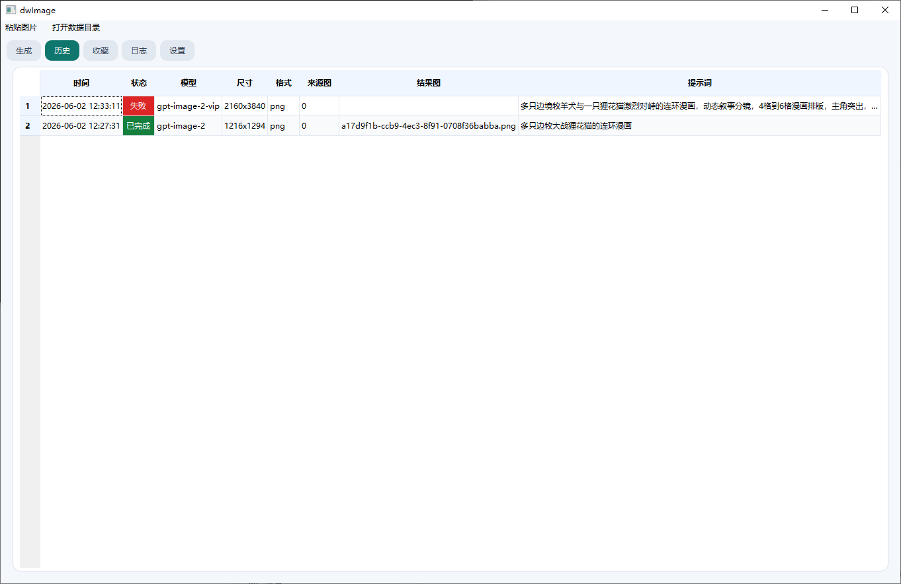

# dwImage

> 面向 Windows 的桌面图像生成客户端，聚焦多图批量生成、参考图工作流与本地高频使用体验。

[](https://github.com/dwkejiPeng/dwImage)
[](https://www.python.org/)
[](LICENSE)

`dwImage` 是一个使用 `PySide6` 构建的 Windows 桌面应用，提供文生图、参考图生成、批量任务、本地历史记录、提示词优化、多 API 配置等能力。  
它适合希望在本地稳定管理出图流程，而不是频繁在网页和脚本之间来回切换的用户。

## 项目定位

- 仅面向 Windows 使用场景
- 优先保证桌面端连续工作流体验
- 兼容多 API 配置，便于切换不同服务
- 强调批量生成、历史沉淀与本地管理

## 主要功能

- 文生图
- 参考图生成 / 编辑 / 重绘
- 多提示词批量生成
- 多参考图批量生成
- 支持“每张参考图单独生成”模式
- 支持拖拽外部图片到窗口任意位置
- 支持粘贴剪贴板图片或复制后的图片文件
- 本地历史记录、收藏夹、请求日志
- 多 API Profile 管理
- Prompt Optimization 配置
- 支持 `Images API`
- 支持 `Responses API`

## 批量生成逻辑

### 1. 多提示词批量

- 切换到批量提示词模式后，每行一个提示词
- 所有提示词共用当前生成配置
- 如果同时上传参考图，则这些提示词会复用同一组参考图

### 2. 多参考图批量

- 合并模式：多张参考图作为同一任务的输入一起生成
- 单独模式：同一个提示词和配置，对每张参考图分别生成 1 张或多张

这也是 `dwImage` 当前最核心的工作流之一。

## 界面与交互特性

- 窗口内任意区域可接收图片拖入
- 生成状态放在预览区域下方，方便持续关注任务进度
- 多任务生成时会显示更明确的等待状态
- 接口报错会尽量展示具体原因，便于排查 API 配置问题
- 默认布局尽量在非全屏窗口内完成主要操作

## 运行环境

- Windows 10 / 11
- Python 3.11 及以上

## 快速开始

### 1. 克隆仓库

```bash
git clone https://github.com/dwkejiPeng/dwImage.git
cd dwImage
```

### 2. 安装依赖

```bash
pip install -r requirements.txt
```

### 3. 启动程序

```bash
python app.py
```

## 首次使用说明

你需要先在应用中配置图像生成 API：

1. 打开“设置”
2. 新增或编辑 API Profile
3. 填写 `Base URL`、`API Key`、`Model`
4. 根据接口能力选择 `Images API` 或 `Responses API`
5. 保存后回到生成页开始使用

## 本地数据目录

程序运行数据默认保存在：

```text
%LOCALAPPDATA%\dwImage
```

常见内容包括：

- `settings.json`
- `mint_image.db`
- `request_logs.jsonl`
- `generated_images/`

如果你从旧版 `MintImage Python` 升级到 `dwImage`，程序会自动尝试迁移旧目录中的本地配置与历史数据。

## 项目结构

```text
dwImage/
├── app.py
├── requirements.txt
├── dwimage/
│   ├── api.py
│   ├── image_store.py
│   ├── main.py
│   ├── models.py
│   ├── prompt_opt.py
│   ├── services.py
│   ├── storage.py
│   └── ui/
│       └── main_window.py
├── README.md
└── LICENSE
```

## 截图

### 首页



### 历史记录



## Roadmap

- 继续优化桌面端紧凑布局与视觉一致性
- 完善多 API Profile 的管理体验
- 增强批量任务状态反馈与失败重试能力
- 增加更稳定的 Windows 打包与发布流程
- 补充截图、演示与更完整的使用文档

## 常见问题

### 1. 改名后原来的配置不见了？

旧版本可能把数据保存在：

```text
%LOCALAPPDATA%\MintImagePython
```

新版本使用：

```text
%LOCALAPPDATA%\dwImage
```

当前版本已加入自动迁移逻辑，首次启动时会尝试迁移旧配置与历史数据。

### 2. 为什么能打开程序但无法生成图片？

通常是以下原因：

- API Key 无效
- Base URL 不正确
- 所选 Model 不支持当前接口模式
- 所选接口与服务端不兼容
- 请求超时或服务端返回错误

建议先查看应用内请求日志与报错信息。

## 参与贡献

欢迎提交 Issue 和 Pull Request。

开始之前建议先阅读：

- [CONTRIBUTING.md](CONTRIBUTING.md)
- [CODE_OF_CONDUCT.md](CODE_OF_CONDUCT.md)
- [SECURITY.md](SECURITY.md)

## 更新记录

- [CHANGELOG.md](CHANGELOG.md)

## 许可证

本项目基于 [MIT License](LICENSE) 开源。

## 致谢

- [PySide6](https://doc.qt.io/qtforpython-6/)
- [Requests](https://requests.readthedocs.io/)
- [Pillow](https://python-pillow.org/)
